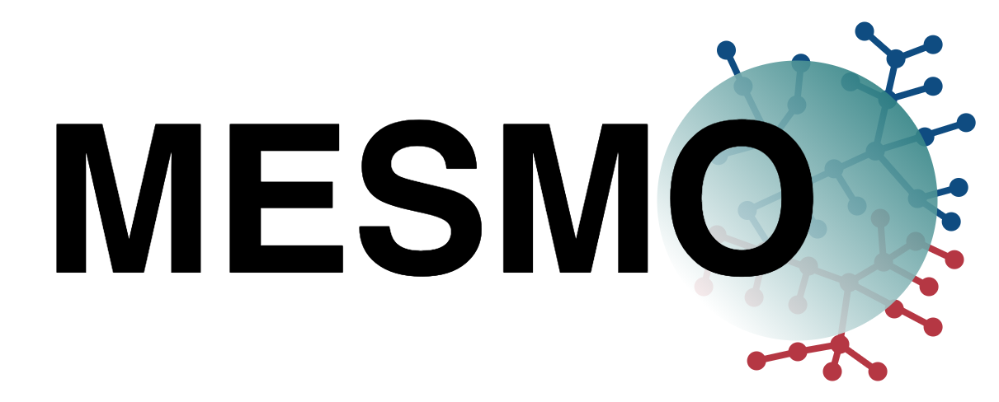

> Work in progress: The repository is under active development and interfaces may change without notice. Please use [GitHub issues](https://github.com/mesmo-dev/mesmo/issues) for raising problems, questions, comments and feedback.

# What is MESMO?

MESMO stand for "Multi-Energy System Modeling and Optimization" and is an open-source Python tool for the modeling, simulation and optimization of multi-scale electric and thermal distribution systems along with distributed energy resources (DERs), such as flexible building loads, electric vehicle (EV) chargers, distributed generators (DGs) and energy storage systems (ESS).

## Features

MESMO implements 1) non-linear models for simulation-based analysis and 2) convex models for optimization-based analysis of electric grids, thermal grids and DERs. Through high-level interfaces, MESMO enables modeling operation problems for both traditional scenario-based simulation as well as optimization-based decision support. An emphasis of MESMO is on the modeling of multi-energy systems, i.e. the coupling of multi-commodity and multi-scale energy systems.

1. **Electric grid modeling**
    - Simulation: Non-linear modeling of steady-state nodal voltage / branch flows / losses, for multi-phase / unbalanced AC networks.
    - Optimization: Linear approximate modeling via global or local approximation, for multi-phase / unbalanced AC networks.
2. **Thermal grid modeling**
    - Simulation: Non-linear modeling of steady-state nodal pressure head / branch flow / pump losses, for radial district heating / cooling systems.
    - Optimization: Linear approximate modeling via global or local approximation, for radial district heating / cooling systems.
3. **Distributed energy resource (DER) modeling**
    - Simulation & optimization: Time series models for non-dispatchable / fixed DERs.
    - Optimization: Linear state-space models for dispatchable / flexible DERs.
    - Currently implemented DER models: Conventional fixed loads, generic flexible loads, flexible thermal building loads, non-dispatchable generators, controllable electric / thermal generators, electric / thermal energy storage systems, combined heat-and-power plants.
4. **Solution interfaces**
    - Simulation: Solution of non-linear power flow problems for electric / thermal grids.
    - Optimization: Solution of convex optimization problems for electric / thermal grids and DERs, through third-party numerical optimization solvers.
    - Generic optimization problem interface: Supports defining custom constraints and objective terms to augment the built-in models. Enables retrieving duals / DLMPs for the study of decentralized / distributed control architectures for energy systems.
    - High-level problem interfaces: Nominal operation problem for simulation-based studies; Optimal operation problem for optimization-based studies.

## Documentation

The documentation is located at [mesmo-dev.github.io/mesmo](https://mesmo-dev.github.io/mesmo).

## Installation

MESMO has not yet been deployed to Python package indexes, but can be installed in a local development environment as follows:

1. Install `conda`-based Python distribution¹ such as [Anaconda](https://www.anaconda.com/distribution/) or [Miniconda](https://docs.conda.io/en/latest/miniconda.html) or [Miniforge](https://github.com/conda-forge/miniforge).
2. Clone or download the repository. Ensure that the `cobmo` submodule directory is loaded as well.
3. In `conda`-enabled shell (e.g. Anaconda Prompt), run:
    - `cd path_to_mesmo_repository`
    - `conda create -n mesmo -c conda-forge python=3.10 contextily`
    - `conda activate mesmo`
    - `python development_setup.py`

MESMO ships with [HiGHS](https://highs.dev/) as default optimization solver², but also supports [Gurobi](http://www.gurobi.com/) and [any CVXPY-supported solvers](https://www.cvxpy.org/tutorial/advanced/index.html#choosing-a-solver).

For notes ¹/² and alternative installation guide, see [docs/installation.md](docs/installation.md).

## Contributing

If you are keen to contribute to this project, please see [docs/contributing.md](./docs/contributing.md).

## Publications

Information on citing MESMO and a list of related publications is available at [docs/publications.md](docs/publications.md).

## Acknowledgements

- MESMO is developed in collaboration between [TUMCREATE](https://www.tum-create.edu.sg/), the [Institute for High Performance Computing, A*STAR](https://www.a-star.edu.sg/ihpc) and the [Chair of Renewable and Sustainable Energy Systems, TUM](https://www.ei.tum.de/en/ens/).
- Sebastian Troitzsch implemented the initial version of MESMO and maintains this repository.
- Sarmad Hanif and Kai Zhang developed the underlying electric grid modeling, fixed-point power flow solution and electric grid approximation methodologies.
- Arif Ahmed implemented the implicit Z-bus power flow solution method & overhead line type definitions.
- Mischa Grussmann developed the thermal grid modeling and approximation methodologies.
- Verena Kleinschmidt implemented several multi-energy DER models, such as the heating plant and CHP plant models. 
- Sebastian Troitzsch and Tom Schelo implemented the optimization problem class.
- This work was financially supported by the Singapore National Research Foundation under its Campus for Research Excellence And Technological Enterprise (CREATE) programme.
