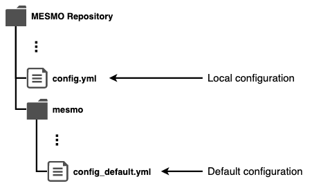
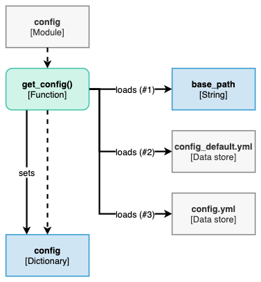

# Configuration

The MESMO configuration is defined via `config.yml`. As an initial user, you likely do not need to modify the configuration.

## Configuration workflow

An empty `config.yml` is created during the first runtime of MESMO. To define the local configuration, simply insert and modify key / value pairs from the configuration references below.



**Figure: Configuration file location.**

MESMO distinguishes 1) local configuration in `config.yml` and 2) default configuration in `config_default.yml`. The local configuration takes precedence over the default configuration. That means, during initialization, `get_config()` first reads the default configuration from `config_default.yml` and then redefines any key / value pairs that have been modified in `config.yml`.



**Figure: Configuration initialization workflow.**

The following sections serve as a reference for configuration key / value pairs. Please note that key / value pairs are defined in a nested structure for each configuration type. This nested structure needs to be replicated for key / value pairs in `config.yml`.

```{important}
Please only modify `config.yml`, but do not make changes to `config_default.yml`.
```

## Optimization solver configuration

### Default configuration

```yaml
optimization:
  solver_name: gurobi
  solver_interface: direct
  show_solver_output: true
  time_limit:
```

### Configuration keys

 - `solver_name`: Defines the optimization solver. Choices are 'gurobi' or any valid solver name [for CVXPY](https://www.cvxpy.org/tutorial/advanced/index.html#choosing-a-solver). Solver name should be defined in lower caps.
 - `solver_interface`: Defines the interface for sending the optimization problem to the solver. Choices are 'direct' or 'cvxpy'. If 'direct', MESMO will use a direct solver interface, which is currently only implemented for Gurobi. If no direct solver interface is available for the selected solver, MESMO will automatically fall back to CVXPY. If 'cvxpy', MESMO will always use CVXPY without checking for a direct solver interface. If not defined, will use 'direct'.
 - `time_limit`: Solver time limit in seconds. If not defined, the value is set to infinite. Currently only implemented for Gurobi and CPLEX.
 - `show_solver_output`: Choices are 'true' or 'false'. If 'true', activate verbose solver output. If 'false', silence any solver outputs.

### Setting CPLEX as optimization solver

As an example, [CPLEX](https://www.ibm.com/analytics/cplex-optimizer) can be defined as the optimization solver with the following configuration snippet:

```yaml
optimization:
  solver_name: cplex
  solver_interface: cvxpy
```

Note that CPLEX is interfaced through CVXPY, because there is currently no direct interface implemented in MESMO. This requires CPLEX to be installed [as per CVXPY instructions](https://www.cvxpy.org/install/index.html#install-with-cplex-support).
